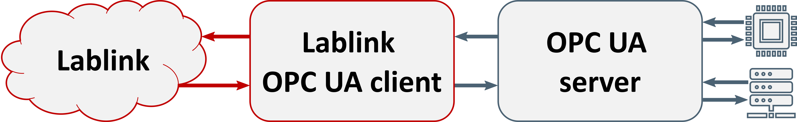

*********************
Lablink OPC UA client
*********************

.. meta::
   :description lang=en: Lablink OPC UA client

This package provides the base functionality for Lablink clients that use `OPC UA <https://reference.opcfoundation.org>`_ for communication.
The clients in this package rely on functionality provided by `Eclipse Milo <https://github.com/eclipse/milo>`_.

The functionality of the clients provided by this package only covers a subset of the large set of functionality defined by the OPC UA standard.
For advanced use cases, where the functionality of this package's Lablink clients is not sufficient, this package provides are reasonable code base to start developing your own clients.

This package provides a basic clients called ``BasicOpcUaClient``, which acts as an adapter between Lablink and an OPC UA server.
Data received by this client will be written to the corresponding variables on the OPC UA server.
Conversely, this client sends data whenever the corresponding variables on the OPC UA server change. 
This data exchange happens only on demand, i.e., whenever either a new input is sent to the client or in case a value changes on the OPC UA server.

This simple adapter only works for basic OPC UA data types (**Boolean**, **SByte**, **Byte**, **Int16**, **UInt16**, **Int32**, **UInt32**, **Int64**, **UInt64**, **Float**, **Double**, **String**).
The adapter takes care of casting these types to/from the data types supported by the Lablink data services (**Double**, **Long**, **Boolean**, **String**).
It does not support other types, complex objects, function calls, etc.

Installation
============

Find information about the installation of the Lablink OPC UA clients :doc:`here <installation>`.

.. toctree::
   :maxdepth: 2
   :hidden:
   :caption: Installation

   /installation
   
Running the clients
===================

Find basic instructions for running the clients :doc:`here <running>`.

.. toctree::
   :maxdepth: 2
   :hidden:
   :caption: Running the clients

   /running

Configuration
=============

Find the reference for writing a configuration for a Lablink OPC UA client :doc:`here <configuration>`.

.. toctree::
   :maxdepth: 2
   :hidden:
   :caption: Configuration

   /configuration

Examples
========

Find step-by-step instructions for running the examples :doc:`here <examples>`.

.. toctree::
   :maxdepth: 2
   :hidden:
   :caption: Examples

   /examples
